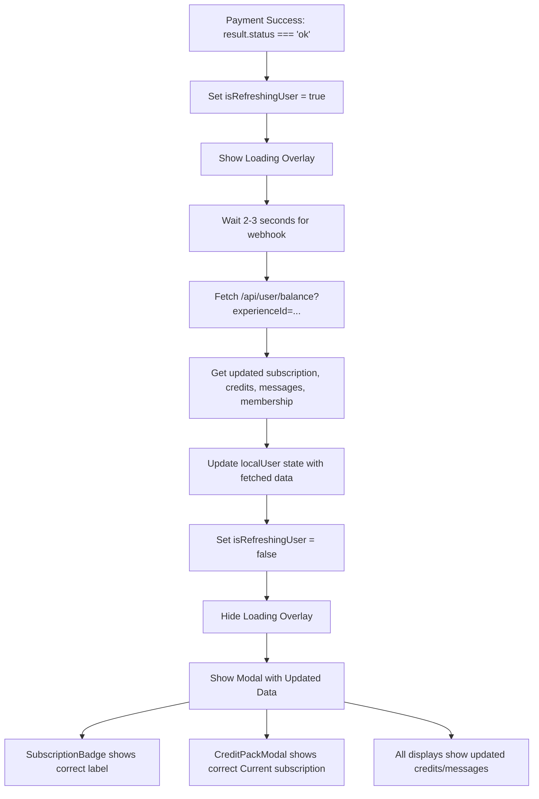

# Refresh User Data After Payment Success with Loading Overlay

## Overview

After successful payment in CreditPackModal, show a loading overlay (similar to SeasonalStore template loading), wait for webhook processing, fetch updated user data from database, then hide overlay and show modal with updated subscription, credits, and messages.

## Changes Required

### 1. Update CreditPackModal to show loading overlay and fetch user data

- **File**: `lib/components/payments/CreditPackModal.tsx`
  - Add state: `const [isRefreshingUser, setIsRefreshingUser] = useState(false)` to track loading state
  - Add state: `const [localUser, setLocalUser] = useState(user)` to track user data locally
  - Update `localUser` when `user` prop changes: `useEffect(() => setLocalUser(user), [user])`
  - After `result?.status === "ok"`:
    - Set `setIsRefreshingUser(true)` to show overlay
    - Wait 2-3 seconds for webhook processing
    - Fetch from `/api/user/balance?experienceId=${experienceId}`
    - Update local state: `setLocalUser(prev => ({ ...prev, ...updatedData }))`
    - Set `setIsRefreshingUser(false)` to hide overlay
  - Use `localUser` instead of `user` prop for all display (subscription, credits, messages, "Current" label)
  - Add loading overlay component (similar to SeasonalStore) that shows when `isRefreshingUser === true`
  - Overlay should cover the entire modal with spinner and "Updating your account..." message

### 2. Create Loading Overlay Component

- **File**: `lib/components/payments/CreditPackModal.tsx` (inline component)
  - Create loading overlay similar to SeasonalStore's overlay:
    - Fixed position covering modal
    - Spinner animation
    - "Updating your account..." text
    - Bouncing dots animation
    - z-index high enough to cover modal content

## Implementation Flow



## Key Points

1. **Loading Overlay**: Show full-screen overlay over modal while fetching (like SeasonalStore template loading)
2. **Simple State Management**: Only update local state in CreditPackModal - no callbacks or parent updates needed
3. **Timeout**: Wait 2-3 seconds after payment success to allow webhook to process database updates
4. **Local State**: Use `localUser` state initialized from `user` prop, updated after fetch
5. **No Parent Updates**: Only CreditPackModal updates - other components will update on next page load/refresh

## Loading Overlay Design

Similar to SeasonalStore's overlay:

- Fixed position covering entire modal
- Background: `bg-white dark:bg-gray-900` with backdrop blur
- Spinner: Blue circular spinner animation
- Text: "Updating your account..." or "Processing payment..."
- Bouncing dots: 3 dots with staggered animation delays
- z-index: High enough to cover all modal content

## API Endpoint

The `/api/user/balance` endpoint already exists and returns:

```typescript
{
  subscription: "Basic" | "Pro" | "Vip" | null,
  credits: number,
  messages: number,
  membership: string | null
}
```

## Testing

- Test subscription purchase → verify overlay shows, then modal shows updated subscription and "Current" label
- Test credit purchase → verify overlay shows, then modal shows updated credits display  
- Test message purchase → verify overlay shows, then modal shows updated messages display
- Test renewal → verify subscription stays same in modal
- Test subscription change → verify modal shows updated subscription label