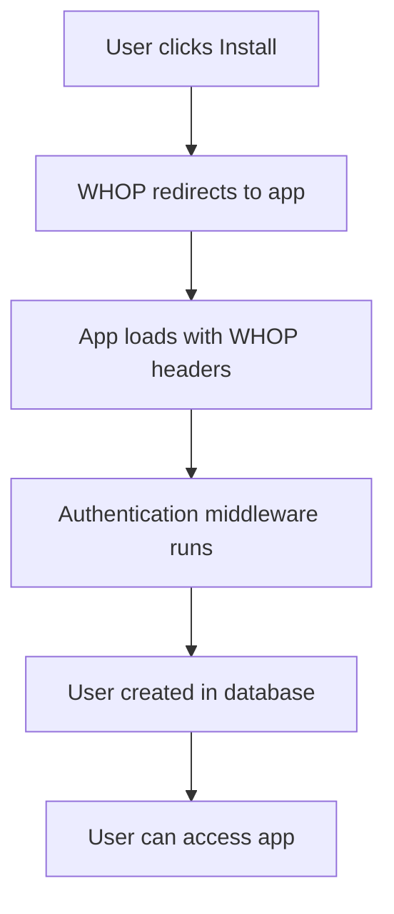

# 🔍 **User Installation Flow Analysis**

## 📋 **Overview**
This document analyzes what happens when a user installs your WHOP app and how they are saved in the users database.

---

## 🚀 **Step-by-Step Installation Flow**

### **1. User Installs App from WHOP** 
When a user clicks "Install" on your app in their WHOP dashboard:



### **2. Authentication Headers**
WHOP automatically sends these headers when the app loads:
- `x-whop-user-token`: User's authentication token
- `x-whop-company-id`: Company ID where app is installed
- `whop-dev-user-token`: Development token (if in dev mode)

### **3. Authentication Process**
The authentication happens in `lib/middleware/simple-auth.ts`:

```typescript
// 1. Extract WHOP user token from headers
const userToken = extractWhopToken(request);

// 2. Verify token with WHOP SDK
const tokenData = await whopSdk.verifyUserToken(request.headers);

// 3. Get company ID from headers
const whopCompanyId = extractCompanyId(request);

// 4. Validate user has access to company
const companyAccess = await whopSdk.access.checkIfUserHasAccessToCompany({
  companyId: whopCompanyId,
  userId: tokenData.userId
});

// 5. Get or create user context
const userContext = await getUserContext(tokenData.userId, whopCompanyId);
```

---

## 🗄️ **Database User Creation Process**

### **Company Creation (if needed)**
```typescript
// Check if company exists
let company = await db.query.companies.findFirst({
  where: eq(companies.whopCompanyId, whopCompanyId)
});

// Create company if it doesn't exist
if (!company) {
  const [newCompany] = await db.insert(companies).values({
    whopCompanyId: whopCompanyId,
    name: 'Company', // Basic name, can be updated later
    description: null,
    logo: null
  }).returning();
  company = newCompany;
}
```

### **User Creation Process**
```typescript
// Check if user exists
let user = await db.query.users.findFirst({
  where: eq(users.whopUserId, whopUserId),
  with: { company: true }
});

// Create user if they don't exist
if (!user) {
  // Fetch user data from WHOP API
  const whopUser = await whopSdk.users.getUser({ userId: whopUserId });
  
  // Create user in our database
  const [newUser] = await db.insert(users).values({
    whopUserId: whopUser.id,
    companyId: company.id,
    email: '', // Email not available in public profile
    name: whopUser.name || whopUser.username || 'Unknown User',
    avatar: whopUser.profilePicture?.sourceUrl || null,
    credits: 2 // Default credits for new users
  }).returning();
}
```

---

## 📊 **Database Schema**

### **Companies Table**
```sql
CREATE TABLE companies (
  id UUID PRIMARY KEY DEFAULT gen_random_uuid(),
  whop_company_id TEXT NOT NULL UNIQUE,
  name TEXT NOT NULL,
  description TEXT,
  logo TEXT,
  created_at TIMESTAMP DEFAULT NOW() NOT NULL,
  updated_at TIMESTAMP DEFAULT NOW() NOT NULL
);
```

### **Users Table**
```sql
CREATE TABLE users (
  id UUID PRIMARY KEY DEFAULT gen_random_uuid(),
  whop_user_id TEXT NOT NULL UNIQUE,
  company_id UUID NOT NULL REFERENCES companies(id) ON DELETE CASCADE,
  email TEXT NOT NULL,
  name TEXT NOT NULL,
  avatar TEXT,
  credits INTEGER DEFAULT 2 NOT NULL,
  created_at TIMESTAMP DEFAULT NOW() NOT NULL,
  updated_at TIMESTAMP DEFAULT NOW() NOT NULL
);
```

---

## 🔄 **User Data Flow**

### **First Time User (New Installation)**
1. **WHOP Headers** → App receives user token and company ID
2. **Token Verification** → WHOP SDK verifies user token
3. **Company Check** → App checks if company exists in database
4. **Company Creation** → If company doesn't exist, create it
5. **User Check** → App checks if user exists in database
6. **WHOP API Call** → Fetch user data from WHOP API
7. **User Creation** → Create user record in database
8. **Access Level** → Determine user's access level (admin/customer)
9. **Context Creation** → Create authenticated user context

### **Returning User**
1. **WHOP Headers** → App receives user token and company ID
2. **Token Verification** → WHOP SDK verifies user token
3. **User Lookup** → Find existing user in database
4. **Data Sync** → Sync user data with WHOP API (if needed)
5. **Context Creation** → Create authenticated user context

---

## 🎯 **Key Features**

### **Automatic User Creation**
- ✅ **No manual registration required**
- ✅ **Users are created automatically on first access**
- ✅ **Data fetched from WHOP API**

### **Company Isolation**
- ✅ **Each company gets its own database record**
- ✅ **Users are linked to their company**
- ✅ **Data isolation between companies**

### **Access Level Management**
- ✅ **Admin vs Customer access levels**
- ✅ **Determined by WHOP permissions**
- ✅ **Automatic access validation**

### **Credit System**
- ✅ **New users get 2 default credits**
- ✅ **Credits tracked per user**
- ✅ **Credit updates via webhooks**

---

## 🔧 **Technical Implementation**

### **Authentication Middleware**
```typescript
// lib/middleware/simple-auth.ts
export async function authenticateRequest(request: NextRequest): Promise<AuthContext | null> {
  // 1. Extract and verify WHOP token
  // 2. Validate company access
  // 3. Get or create user context
  // 4. Return authenticated context
}
```

### **User Context Management**
```typescript
// lib/context/user-context.ts
export async function getUserContext(
  whopUserId: string,
  whopCompanyId: string
): Promise<UserContext | null> {
  // 1. Get or create company
  // 2. Get or create user
  // 3. Sync data with WHOP
  // 4. Determine access level
  // 5. Return user context
}
```

### **WHOP SDK Integration**
```typescript
// lib/whop-sdk.ts
export const whopSdk = WhopServerSdk({
  appId: process.env.NEXT_PUBLIC_WHOP_APP_ID,
  appApiKey: process.env.WHOP_API_KEY,
  onBehalfOfUserId: process.env.NEXT_PUBLIC_WHOP_AGENT_USER_ID,
  companyId: process.env.NEXT_PUBLIC_WHOP_COMPANY_ID,
});
```

---

## 📈 **User Data Examples**

### **New User Creation**
```json
{
  "id": "uuid-generated-id",
  "whopUserId": "user_abc123",
  "companyId": "company-uuid",
  "email": "",
  "name": "John Doe",
  "avatar": "https://whop.com/avatars/user_abc123.jpg",
  "credits": 2,
  "createdAt": "2024-01-15T10:30:00Z",
  "updatedAt": "2024-01-15T10:30:00Z"
}
```

### **Company Creation**
```json
{
  "id": "company-uuid",
  "whopCompanyId": "comp_xyz789",
  "name": "Company",
  "description": null,
  "logo": null,
  "createdAt": "2024-01-15T10:30:00Z",
  "updatedAt": "2024-01-15T10:30:00Z"
}
```

---

## 🚨 **Important Notes**

### **Development Mode**
- **Test Token**: Uses `test-token` for local development
- **Test User**: Creates `test-user-id` with 10 credits
- **Bypass WHOP**: Skips WHOP API calls in development

### **Production Mode**
- **Real WHOP API**: All calls go to WHOP API
- **Token Validation**: Strict token verification
- **Company Access**: Validates user access to company

### **Data Synchronization**
- **Automatic Sync**: User data synced with WHOP on each access
- **Caching**: User context cached for performance
- **Error Handling**: Graceful fallbacks for API failures

---

## 🎉 **Summary**

When a user installs your WHOP app:

1. **WHOP sends authentication headers** to your app
2. **Your app verifies the user token** with WHOP SDK
3. **Company is created** in your database (if first user from that company)
4. **User data is fetched** from WHOP API
5. **User record is created** in your database
6. **Access level is determined** based on WHOP permissions
7. **User can access the app** with their authenticated context

The process is **fully automated** - no manual registration required. Users are created on-demand when they first access your app, with their data automatically synced from WHOP.
