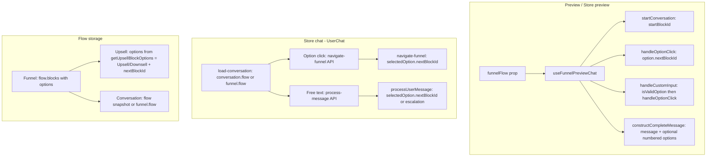

# Conversation structure and next-message logic (Qualification vs Upsell, Preview vs Store chat)

## 1. Data model: flow structure

### Block type vs stage card type

- **Blocks have no type.** `FunnelBlock` has no `type` or `cardType` field. Card behavior is determined by the **stage** the block belongs to.
- **Stage card type** (`FunnelStage.cardType?: "qualification" | "product"`) is the single source of truth for card behavior:
  - `cardType === "product"` → product card: always show product CTA button (grey, non-clickable when resource link is unavailable); do not show numbered options in message text.
  - `cardType === "qualification"` or unset → options-based card; no product button from this stage; show numbered options when applicable.
- **Stage `name`** (e.g. OFFER, VALUE_DELIVERY, WELCOME) is **informational only** (progress bar, admin UI). Do not use stage name for control flow; use `isProductCardBlock(blockId, funnelFlow)` and `getProductCardButtonLabel(blockId, funnelFlow)` from [lib/utils/funnelUtils.ts](lib/utils/funnelUtils.ts).

### Unified block options

- **Qualification**: Blocks have `options: Array<{ text, nextBlockId }>`. Navigation uses `option.nextBlockId`.
- **Upsell**: In the builder, blocks use `upsellBlockId` and `downsellBlockId`. When reading/writing flow, options are derived via `getUpsellBlockOptions(block)` in [lib/utils/funnelUtils.ts](lib/utils/funnelUtils.ts): `[{ text: "Upsell", nextBlockId: upsellBlockId }, { text: "Downsell", nextBlockId: downsellBlockId }]`.
- **At runtime** (preview, store chat, APIs): Flow is always **option-based**. Upsell blocks are stored with `options[].nextBlockId` already set (synced on save in AIFunnelBuilderPage). No separate handling for `upsellBlockId`/`downsellBlockId` in chat or process-message/navigate-funnel.

### Flow source

- **Conversation**: `conversation.flow` (custom per conversation) or `conversation.funnel.flow` (funnel default).
- **Preview / Store preview**: Uses the funnel’s flow passed as prop (no conversation DB).

---

## 2. Preview view (no backend)

### Entry points

- **Preview (merchant)**: [lib/components/preview/PreviewChat.tsx](lib/components/preview/PreviewChat.tsx) → `useFunnelPreviewChat(funnelFlow, resources, undefined, undefined, experienceId)`.
- **Store preview**: [lib/components/store/StorePreviewChat.tsx](lib/components/store/StorePreviewChat.tsx) → same hook.
- **Seasonal store chat**: [lib/components/store/SeasonalStore/components/SeasonalStoreChat.tsx](lib/components/store/SeasonalStore/components/SeasonalStoreChat.tsx) → same hook with `useFunnelPreviewChat(funnelFlow, resources, undefined, undefined, experienceId)`.

### Logic in useFunnelPreviewChat ([lib/hooks/useFunnelPreviewChat.ts](lib/hooks/useFunnelPreviewChat.ts))

| Concern | Behavior |
|--------|----------|
| **Start** | `startConversation()` uses `funnelFlow.startBlockId` (or `conversation?.currentBlockId` when restoring). Pushes one bot message from `constructCompleteMessage(startBlock)` and sets `currentBlockId`. |
| **Next message (option click)** | `handleOptionClick(option, index)` → if `!option.nextBlockId` then conversation ends (`setCurrentBlockId(null)`). Else `nextBlock = funnelFlow.blocks[option.nextBlockId]`, pushes user message (option text), then bot message `constructCompleteMessage(nextBlock)`, then `setCurrentBlockId(option.nextBlockId)`. |
| **Next message (free text)** | `handleCustomInput(input)` → `isValidOption(input, currentBlock)` (number, exact, fuzzy, synonyms). If valid → `handleOptionClick(option, index)`; else pushes user + bot "Please choose one of the available options above." |
| **Message content** | `constructCompleteMessage(block)`: product cards (`stage.cardType === "product"`) get product link button (always; grey when no link). Button label from `getProductCardButtonLabel` (Claim! for VALUE_DELIVERY name, Get Started! otherwise). If stage is product card or WELCOME / TRANSITION / PAIN_POINT_QUALIFICATION / EXPERIENCE_QUALIFICATION → **no numbered options in text**; else appends `1. opt.text\n2. ...`. |
| **Options shown in UI** | `options = currentBlock?.options` (from flow), excluding TRANSITION (auto-proceed) and product-card blocks with Upsell/Downsell (show only CTA). TRANSITION blocks: effect auto-calls `handleOptionClick(firstOption, 0)` after 50ms. |
| **Qualification vs Upsell** | Both use `block.options` and `option.nextBlockId`. Upsell product-card blocks have options `Upsell`/`Downsell` with `nextBlockId` from flow; preview hides those option buttons and shows only message + CTA. |

### Special cases in preview

- **TRANSITION**: Options hidden from display; first option is auto-selected after 50ms; optional `redirect_to_live_chat` system message for styling.
- **Blocks with no options**: Effect sets `currentBlockId` to `null` (conversation end).
- **Path to offer**: `doesPathLeadToOffer` / `findOptionsLeadingToOffer` used for highlighting which options lead to selected offer (preview UX only).

---

## 3. Store chat (with backend: UserChat)

### Entry point

- [lib/components/userChat/UserChat.tsx](lib/components/userChat/UserChat.tsx): when `conversationId` and `experienceId` exist, uses **load-conversation** for state and **two APIs** for sending: **navigate-funnel** (option click) and **process-message** (free text).

### Flow and current block

- Flow: from `conversation` (load-conversation): `conversation.flow ?? conversation.funnel.flow`.
- Current block: `localCurrentBlockId ?? conversation?.currentBlockId`; updated after navigate-funnel or process-message via `setLocalCurrentBlockId(nextBlockId)`.

### Option click (Upsell or Qualification)

1. User clicks option → `handleOptionClickLocal` → `handleConversationOptionSelection(option)`.
2. Optimistic: append user message with `option.text`.
3. **POST /api/userchat/navigate-funnel** with `{ conversationId, navigationData: { text: option.text, value: option.text, blockId: currentBlockId } }`.
4. **navigate-funnel** ([app/api/userchat/navigate-funnel/route.ts](app/api/userchat/navigate-funnel/route.ts)):
   - Loads conversation, resolves `funnelFlow` (conversation.flow or funnel.flow).
   - Finds `currentBlock = funnelFlow.blocks[currentBlockId]`, then `selectedOption = currentBlock.options.find(opt => text match)`.
   - **nextBlockId = selectedOption.nextBlockId** (same for qualif and upsell).
   - Inserts `funnelInteractions`, updates `conversations` (currentBlockId, currentBlockEnteredAt, userPath, lastNotificationSequenceSent), inserts user message, then builds bot message for `nextBlock`.
   - Bot message: product cards (`isProductCardBlock`) → always append product button (resource link or `#` for grey); other blocks → app link button. Placeholder resolution ([USER], etc.) applied; [LINK] stripped.
   - Inserts bot message, returns `{ conversation, nextBlockId, botMessage }`.
5. UserChat: appends `botMessage` to UI, sets `localCurrentBlockId(result.conversation.currentBlockId)`.

### Free text (Upsell or Qualification)

1. User sends text → `handleSubmit` → **POST /api/userchat/process-message** with `{ conversationId, messageContent }`.
2. **process-message** ([app/api/userchat/process-message/route.ts](app/api/userchat/process-message/route.ts)) → [lib/actions/simplified-conversation-actions.ts](lib/actions/simplified-conversation-actions.ts) `processUserMessage`:
   - Loads conversation, resolves `funnelFlow`, reads `currentBlockId`.
   - Adds user message to DB.
   - Resolves option: text match (exact, includes) or number (e.g. "1" → first option).
   - If match → **processValidOptionSelection**: `nextBlockId = selectedOption.nextBlockId`, updates conversation (currentBlockId, currentBlockEnteredAt, userPath, lastNotificationSequenceSent), inserts funnel interaction, builds bot message from `nextBlock.message` (no options in text), inserts bot message, returns `{ success, botMessage, nextBlockId }`.
   - If no match and **product-card** stage (`isProductCardBlock`) → acknowledgment only, no escalation.
   - If no match and not OFFER → **handleEscalation** (progressive “choose option” / “I’ll inform owner” / “contact owner”).
3. UserChat: appends `funnelResponse.botMessage`, sets `localCurrentBlockId(funnelResponse.nextBlockId)`.

### Upsell-specific in UserChat

- **Options on product-card stage**: `isUpsellOfferStage = merchantType === "upsell" && stageInfo?.currentStage === "OFFER"` (currentStage is display name from load-conversation) → `options = []` so Upsell product cards show **no option buttons** (product + CTA only; Upsell/Downsell choices are not offered again in that view).
- **Displayed messages**: For Upsell product-card stage, `displayedMessages` filters to show only the **last** bot message (hide previous offers).

---

## 4. Flow summary

---

## 5. Differences: Qualification vs Upsell

| Aspect | Qualification | Upsell |
|--------|----------------|--------|
| **Block options** | Edited as list of { text, nextBlockId }. | In builder: upsellBlockId / downsellBlockId; at runtime: options = [{ text: "Upsell", nextBlockId }, { text: "Downsell", nextBlockId }]. |
| **Next block** | Always `option.nextBlockId`. | Same: `option.nextBlockId` (synced from upsellBlockId/downsellBlockId). |
| **Preview** | Same hook and logic; options and next message from flow. | Same; product-card block shows product + CTA; Upsell/Downsell option buttons hidden in preview. |
| **Store chat – option click** | navigate-funnel with option text → nextBlockId from options. | Same; "Upsell"/"Downsell" matched by text, nextBlockId from options. |
| **Store chat – free text** | process-message matches option by text/number → processValidOptionSelection. | Same; "Upsell"/"Downsell" or "1"/"2" resolve to same nextBlockId. |
| **Store chat – product-card UI** | Options shown (e.g. product choices). | Upsell: options hidden (`isUpsellOfferStage` → options = []); only last bot message shown. |

---

## 6. Where “next message” is decided

| Context | Where | How next block is chosen |
|---------|--------|---------------------------|
| **Preview** | useFunnelPreviewChat | User picks option → `option.nextBlockId` → next block message from `constructCompleteMessage(nextBlock)`. |
| **Store – option click** | navigate-funnel route | Match option by text → `selectedOption.nextBlockId` → next block; bot message from next block (product cards get product button always; grey when no link). |
| **Store – free text** | processUserMessage | Match option by text or number → processValidOptionSelection → `selectedOption.nextBlockId`; bot message = nextBlock.message. |

No separate “upsell” or “qualification” path for choosing the next block: both use **options and nextBlockId** from the same flow structure.

---

## 7. Files reference

- **Preview hook**: [lib/hooks/useFunnelPreviewChat.ts](lib/hooks/useFunnelPreviewChat.ts) – start, option click, custom input, constructCompleteMessage, options list.
- **Process message (store free text)**: [lib/actions/simplified-conversation-actions.ts](lib/actions/simplified-conversation-actions.ts) – processUserMessage, processValidOptionSelection, handleEscalation.
- **Navigate funnel (store option click)**: [app/api/userchat/navigate-funnel/route.ts](app/api/userchat/navigate-funnel/route.ts) – processFunnelNavigation, nextBlockId from selectedOption, bot message and placeholders.
- **Process-message API**: [app/api/userchat/process-message/route.ts](app/api/userchat/process-message/route.ts) – calls processUserMessage.
- **Load conversation**: [app/api/userchat/load-conversation/route.ts](app/api/userchat/load-conversation/route.ts) – returns conversation + flow + currentBlockId.
- **Funnel utils**: [lib/utils/funnelUtils.ts](lib/utils/funnelUtils.ts) – getUpsellBlockOptions, isProductCardBlock, getProductCardButtonLabel, getStageNameForBlock; used for card behavior and options sync.
- **UserChat**: [lib/components/userChat/UserChat.tsx](lib/components/userChat/UserChat.tsx) – uses same flow + navigate-funnel + process-message; Upsell product-card stage: hide options, show last bot only.
